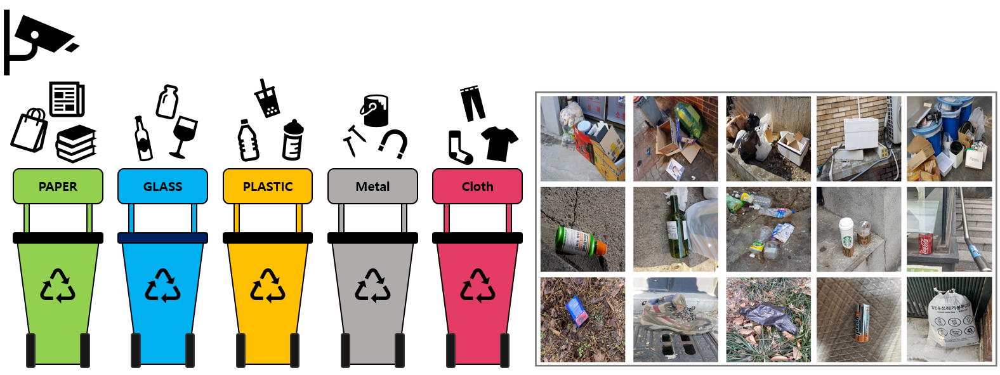
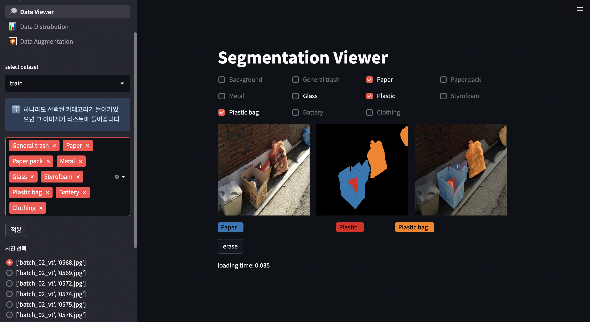
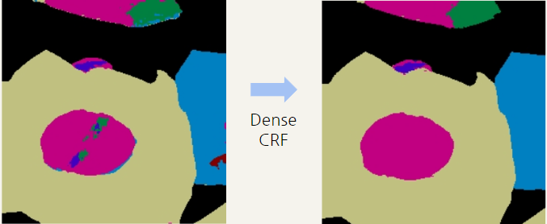

# Level2 Wrap-up Report

# Semantic Segmentation Competition

### 프로젝트 개요

바야흐로 대량 생산, 대량 소비의 시대. 우리는 많은 물건이 대량으로 생산되고, 소비되는 시대를 살고 있습니다. 하지만 이러한 문화는 '쓰레기 대란', '매립지 부족'과 같은 여러 사회 문제를 낳고 있습니다.

분리수거는 이러한 환경 부담을 줄일 수 있는 방법 중 하나입니다. 잘 분리배출 된 쓰레기는 자원으로서 가치를 인정받아 재활용되지만, 잘못 분리배출 되면 그대로 폐기물로 분류되어 매립 또는 소각되기 때문입니다.

따라서 우리는 사진에서 쓰레기를 Detection 하는 모델을 만들어 이러한 문제점을 해결해보고자 합니다. 문제 해결을 위한 데이터셋으로는 일반 쓰레기, 플라스틱, 종이, 유리 등 10 종류의 쓰레기가 찍힌 사진 데이터셋이 제공됩니다.

여러분에 의해 만들어진 우수한 성능의 모델은 쓰레기장에 설치되어 정확한 분리수거를 돕거나, 어린아이들의 분리수거 교육 등에 사용될 수 있을 것입니다. 부디 지구를 위기로부터 구해주세요! 🌎

- **Input :** 쓰레기 객체가 담긴 이미지가 모델의 인풋으로 사용됩니다. Segmentation Annotation은 COCO format으로 제공됩니다.
- **Output :** 모델은 Pixel 좌표에 따라 카테고리 값을 리턴합니다. 이를 Submission 양식에 맞게 csv 파일을 만들어 제출합니다.
- 프로젝트 팀 구성 및 역할

| 팀원 / 역할 | [Streamlit](https://github.com/SeongKeunNA/streamlit_project) | Detectron2 | Paper Review |
| --- | --- | --- | --- |
| 오주헌 | Data Viewer 레이블 표시 | DiNAT, SegFormer | [DiNAT](https://velog.io/@ozoooooh/%EB%85%BC%EB%AC%B8%EB%A6%AC%EB%B7%B0Dilated-Neighborhood-Attention-Transformer) |
| 강민수 | Segmentation 시각화 | MaskDino/DenseCRF/Ensemble/ Copy and Paste | [ClassMix](https://velog.io/@tec10182/ClassMix) |
| 신성윤 | Albumentation demo 통합 / 제출 파일(image, mask) 시각화 | Mask2Former / Copy and Paste | [Mask2Former](https://velog.io/@sshinohs/MaskFormer-Mask2Former) |
| 나성근 | Data distribution 시각화 | SeMaskMask2Former/Pseudo Labeling | [SeMask](https://arxiv.org/abs/2112.12782) |
| 박시형 | Streamlit Data Viewer Page | SegViT, SeMaskFAPN | [CDBLoss]() |

### 프로젝트 수행 절차 및 방법

1. Streamlit을 이용해서 EDA 진행
    1. EDA 과정을 팀원들과 쉽게 공유
2. Mask2Former을 이용한 Segmentation Model Architecture를 Baseline으로 설정
    1. 여러 모델 실험 (MaskDINO, SegFormer UperNet, SegViT)
3. Backbone을 DiNAT / SeMask로 설정
4. Dense CRF를 이용한 앙상블 전략 실험
5. Pseudo Labeling 실험

- EDA
    
    
    - 데이터 직접 살펴보기
        - 통계 분석 과정에서 확인하기 어려운 데이터의 특성 파악
            - Plastic bag 안에 있는 쓰레기를 구분하는가?
            - Mislabel된 데이터는 얼마나 존재하는가?
    - Statistical Analysis
        - Class distribution
        - Color distribution by class
        - Number of object per image
        - Annotation size proportion per image
- Model Architecture
    
    
    |  | Backbone |
    | --- | --- |
    | Mask2Former | Swin-B, Swin-L, DiNAT-L |
    | SeMask | FAPN-Swin-L, Swin-L |
- Augmentation
    
    
    |  | Geometric | Color |
    | --- | --- | --- |
    | SeMask | Multi-Scaling Training(256~1024) Random Horizontal Flip         | Color Jittering |
    | DiNAT | Multi-Scaling Training (320~1280)                                 Random Horizontal Flip | Color Jittering |
- Copy and Paste
    
    Copy & Paste 방식을 이용하여 Validation 성능이 낮은 Class를 증강하는 목표
    
    → Detectron2 내부에서는 Augmentation 구현이 어려워 다음과 같은 방식으로 진행
    
    1. 미리 Copy & Paste 이미지를 만들어 두고 학습 진행
        
         → 이미 성능이 잘 나오는 Class의 데이터도 같이 증강된 것으로 예상되어 성능 하락
             (Public LB mIoU: 0.77 → 0.72)
        
    2. Evaluation Hook에 Copy & Paste 이미지를 생성하는 코드를 등록 후 Evaluation할 때 마다 400개의 이미지를 랜덤하게 변환
        
        → 지정된 Class에 대한 Validation은 증가하였지만 다른 Class에 대한 성능이 하락한 것으로 예상되어 성능은 비슷하게 유지(Public LB mIoU: 0.77 → 0.77)
        
- Hyperparameter Tuning
    
    
    |  | LR | Optimizer | Scheduler |
    | --- | --- | --- | --- |
    | Mask2Former | 0.0001 | AdamW | WarmupPolyLr+MultiStep |
- Ensemble(Final Submission)

     a. Pixel 단위 Ensemble → Masking Image에 Noise가 발생
    
    
    
     b. Noise를 해결하기 위하여 DenseCRF 사용 → 작은 물체가 무시되는 경향이 발생
    
    
    
     c. b의 문제를 해결하기 위해 다시 Ensemble을 하여 DenseCRF를 제외한 다른 모델들에서 공통적으로 잡아내는 물체에 대하여 Pixel값을 Overwrite
    
- Pseudo Labeling
    - 3가지 모델(SeMask, SeMask-FAPN, DiNAT) 각각의 Best Result를 512x512로 Inference한 결과들을 Ensemble한 뒤, Pseudo Labeling 진행
        
        | Model | LB(Single) | LB(Pseudo Labeling) |
        | --- | --- | --- |
        | SeMask | 0.774 | 0.787 |
        | SeMask-FAPN | 07724 | 0.7842 |
        | DiNAT-L | 0.7763 | 0.7838 |
        | Swin-L | 0.7718 | 0.75 |
- Model FLOPs and Parameters
    
    | Model | FLOPs(G) | Parameters(M) |
    | --- | --- | --- |
    | Mask2Former-Swin-L | 630 | 215 |
    | Mask2Former-Dinat-L | 510 | 220 |
    | SeMask-Swin-L | 643 | 223 |

### 프로젝트 수행 결과

- 핵심 실험 내용
    
    
    | Experiment | LB(mIoU) |
    | --- | --- |
    | UperNet-Swin-B | 0.6 |
    | UperNet-Swin-L | 0.7 |
    | MaskDino-Swin-L | 0.74 |
    | Mask2Former-Swin-B | 0.7210 |
    | Mask2Former-Swin-L | 0.7718 |
    | SeMask-FAPN-Swin-L | 0.7724 |
    | Mask2Former-Dinat-L | 0.7763 |
    | SeMask-Swin-L | 0.783 |
    | Dense-CRF+Ensemble(DiNAT+SeMask) | 0.7895 |
    | Ensemble-ALL | 0.7989 |
    
- 최종 제출: Public: 0.7989(2nd) / Private: 0.7831(1st)
